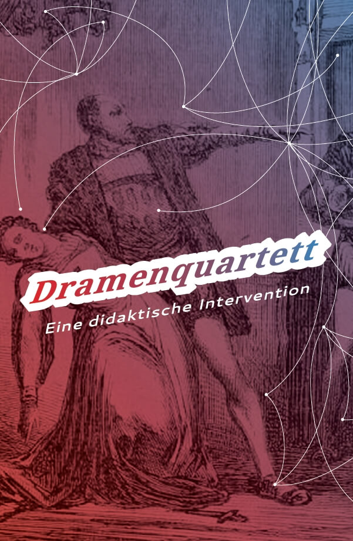
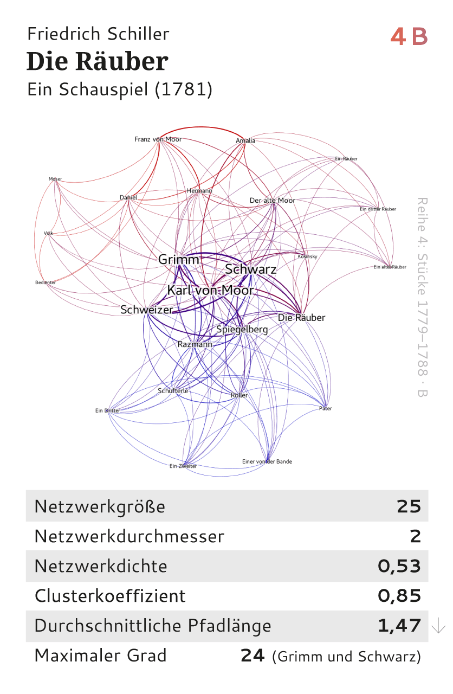
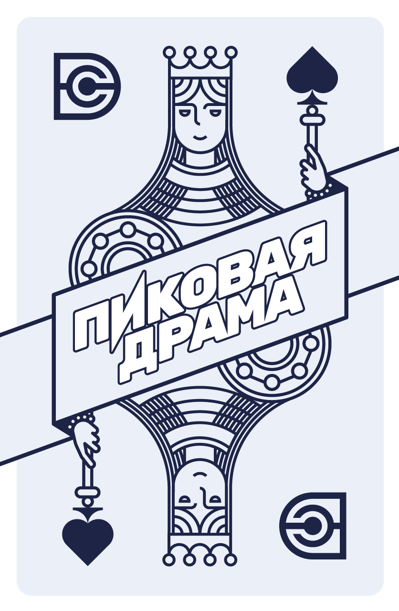

# Card games

#### Battle of the Plays

*by Frank Fischer, Mark Schwindt*

* 32 cards containing network data of plays from antiquity to the 20th century (from Aeschylus to Beckett)
* Released in October 2024, [order at SUKULTUR (Berlin, Germany)](https://sukultur.de/produkt/battle-of-the-plays-a-gamification-approach-to-literary-network-analysis/), ISBN 978-3-95566-182-3
* [General information and rules of play](https://battle-of-the-plays.github.io/)

---

#### Dramenquartett

*by Frank Fischer, Anika Schultz*

* 32 cards containing network data of German-language plays from 1730–1930
* Released in December 2019, [order at etkbooks (Bern, Switzerland)](https://www.etkbooks.com/dramenquartett/), ISBN 978-3-905846-55-3
* [General information and rules of play (in German)](https://dramenquartett.github.io/)
* Update 2022: out of print (you can order an alternative version of the card game, see above, »Battle of the Plays«)

---

#### Toneelkwartetspel

*by Felix Hermans, Arne Lauryssens, Jan Teertstra, Anke Van de Mosselaer, Sam Verellen*

* 32 cards containing network data of Dutch-language plays from the 14th to 19th century (limited edition)
* Created in the course »Digitale tekstanalyse en literaire theorie« at University of Antwerp 2019/2020 under the supervision of Mike Kestemont

---

#### Пиковая драма (Pikovaya drama)

*by Frank Fischer, Mark Schwindt*

* 32 cards containing network data of Russian plays from the 18th to 20th century
* Update 2022: publication put on hold
