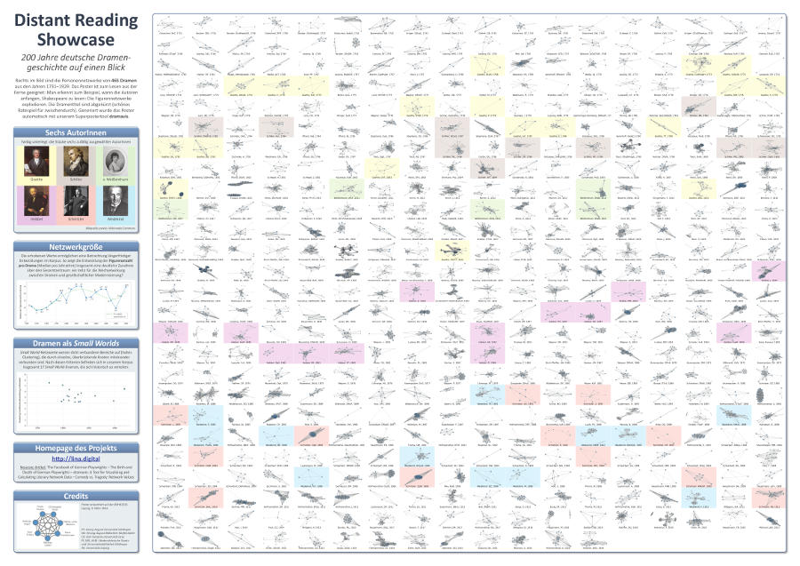
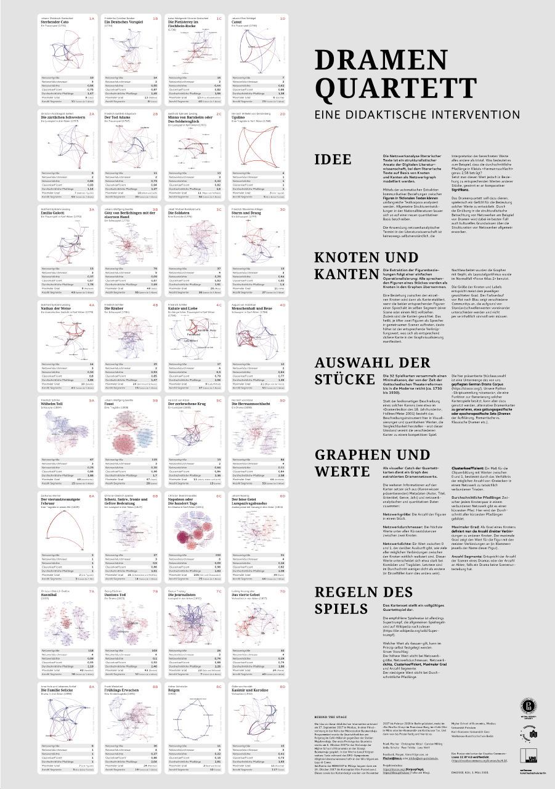
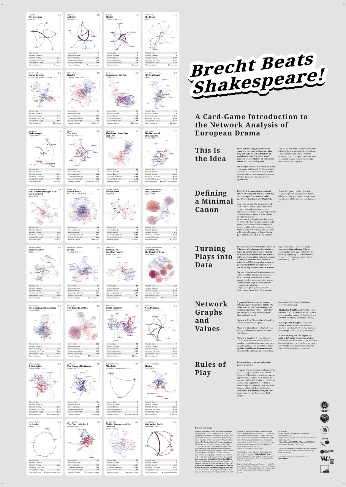

# DraCor Posters

Our award-winning conference posters are freely available for download in hi-res, licensed under [CC BY 4.0](https://creativecommons.org/licenses/by/4.0/), feel free to have your own copy printed (original format: A0).

#### Distant-Reading Showcase: 465 German-Language Dramas at a Glance (DHd2016, Leipzig)

*by Frank Fischer, Christopher Kittel, Peer Trilcke, Mathias Göbel, Andreas Vogel, Hanna-Lena Meiners, Dario Kampkaspar*

* [Best Poster Award](http://dig-hum.de/gewinner-des-posterawards-2016) 🏆
* [figshare](https://doi.org/10.6084/m9.figshare.3101203) (poster)
* [dlina.github.io](https://dlina.github.io/Distant-Reading-Showcase-Poster-DHd2016-Leipzig/) (blog post)

---

#### Dramenquartett – Eine didaktische Intervention (DHd2018, Cologne)

*by Frank Fischer, Christopher Kittel, Carsten Milling, Anika Schultz, Peer Trilcke, Jana Wolf*

* [Best Poster Award](https://texperimentales.hypotheses.org/2462#Preisverleihung) 🏆
* [figshare](https://doi.org/10.6084/m9.figshare.5926363) (poster)
* [Twitter](https://twitter.com/umblaetterer/status/969219085585313792)

---

#### Brecht Beats Shakespeare! A Card-Game Introduction to the Network Analysis of European Drama (DH2018, Ciudad de México)

*by Frank Fischer, Anika Schultz, Christopher Kittel, Elisa Beshero-Bondar, Steffen Martus, Peer Trilcke, Jana Wolf, Ingo Börner, Angelika Hechtl, Daniil Skorinkin, Tatiana Orlova, Carsten Milling, Christine Ivanovic*

* [figshare](https://doi.org/10.6084/m9.figshare.6667424) (poster)
* [Twitter](https://twitter.com/umblaetterer/status/1012048790730223621)

---

#### Besuch im »Marstheater« – Eine Netzwerkmodellierung von Karl Kraus’ Riesendrama »Die letzten Tage der Menschheit« (DHd2020, Paderborn)

*by Frank Fischer, Anna Busch, Angelika Hechtl, Peer Trilcke, Andreas Vogel*

* [Best Poster Award](https://dig-hum.de/dhd-awards) 🏆
* [figshare](https://doi.org/10.6084/m9.figshare.11917902) (poster)
* [Twitter thread](https://twitter.com/umblaetterer/status/1235556225128886277)
* [zenodo](https://zenodo.org/record/3666690/preview/2020_DHd_BookOfAbstracts-web.pdf#page=280) (abstract)
* [weltliteratur.net](https://weltliteratur.net/theatre-on-mars/) (blog post)
