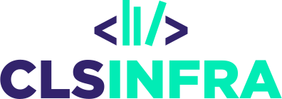
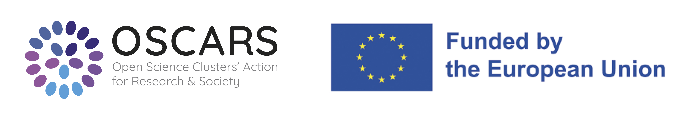

# What is DraCor?

**DraCor** (short for »drama corpora«) is an open digital infrastructure developed for the computational study of (mostly) European drama from Greco-Roman antiquity to the 20th century.

**Our platform hosts plays encoded in the [TEI format](https://en.wikipedia.org/wiki/Text_Encoding_Initiative) in multiple languages**, supporting both comparative and computational approaches to literary studies. Each corpus is maintained by individual editors and is dynamic – continuously growing in the number of plays and enriched with increasingly detailed markup (see the [corpora overview](corpora)).

**DraCor is a showcase for the concept of [Programmable Corpora](https://doi.org/10.5281/zenodo.4284002).** It revolves around an API that provides data extracted from our TEI-encoded corpora. This website – dracor.org – uses this API to showcase some of the extractable information. Some data can be downloaded through the web interface. The more powerful, direct access point is the [documented API](api).

**DraCor is an ecosystem.** You can connect to it on different levels. The platform was built to facilitate compliance with the [FAIR principles](https://www.go-fair.org/fair-principles/). We offer easy-to-use apps that let you explore different aspects of the corpora – for example, our [DraCor Shiny app](https://shiny.dracor.org/), which allows you to experiment with co-occurrence networks. We provide API wrappers for Python ([pydracor](https://pypi.org/project/pydracor/)), R ([rdracor](https://cran.r-project.org/web/packages/rdracor/index.html)) and Haskell (in development). In general, you are free to connect to the API the way you prefer.

**DraCor sets out to be a living part of the Linked Open Data cloud.** We use Wikidata (and other) identifiers for authors, plays and characters. We also expose a [SPARQL endpoint](https://dracor.org/sparql) (in revision) so our own ontology can be queried, including many entities extracted from our corpora, like individual characters. (Have a look at the DraCor ontology [via WebVOWL](https://vowl.acdh.oeaw.ac.at/#iri=https://raw.githubusercontent.com/dracor-org/dracor-schema/ontology/ontology/dracor-ontology.xml).) Our LOD component will be further developed and we will look closely at how we can cooperate with neighbouring projects.

**DraCor aims to create an interface between traditional and digital literary studies.** The extent to which you can involve DraCor in your research on European drama (or literature in general), depends on your level of technical expertise (or support). We are part of the continuous learning process that accompanies the practice of Digital Humanities and actively support the creation of more teaching and training material around DraCor.

**DraCor's stability and sustainability** are key tasks for the near future. The project has come this far thanks to the enthusiasm of volunteers, without any direct third-party funding. While the platform will continue to evolve in parallel with new research questions, it should also become a stable infrastructure and reference point for (digital) literary studies and beyond. This will be a major focus of our ongoing work.

**Ways to interact.** To keep discussions about DraCor on the spot, we use the GitHub Discussions feature (which is still in beta!) for the repositories [dracor-frontend](https://github.com/dracor-org/dracor-frontend/discussions) (everything concerning the website) and [dracor-api](https://github.com/dracor-org/dracor-api/discussions) (everything concerning our API functionality). If you want, ask questions or make suggestions directly there. There is also a [DraCor mailing list](https://www.listserv.dfn.de/sympa/info/dracormailinglist) you can [subscribe](https://www.listserv.dfn.de/sympa/subscribe/dracormailinglist) to.

Preferred hashtags: **#DraCor** **#ProgrammableCorpora** **#DigitalHumanities**

DraCor as a project and the platform dracor.org are run jointly by our team at Freie Universität Berlin and University of Potsdam. For a full list of credits, please see our [Credits page](credits).

In the context of [CLS INFRA](https://clsinfra.io/), the project has received
funding from the European Union's Horizon 2020 research and innovation programme
under grant agreement
[No. 101004984](https://cordis.europa.eu/project/id/101004984).

Funded by the Deutsche Forschungsgemeinschaft (DFG, German Research Foundation) under Germany's Excellence Strategy in the context of the Cluster of Excellence Temporal Communities: Doing Literature in a Global Perspective – EXC 2020 – Project [ID 390608380](https://gepris.dfg.de/gepris/projekt/390608380).

OSCARS is a four-year EU-funded project that strives to foster the uptake of
Open Science in Europe by consolidating the achievements of world-class European
research infrastructures in the ESFRI roadmap and beyond into lasting
interdisciplinary FAIR data services and working practices. The project aims to
strengthen the role of the Science Clusters in the ERA by developing
domain-based Competence Centres and by fostering the implementation of Open
Science projects funded through a cascading grant mechanism.

In 2023, [Transkribus](https://readcoop.eu/transkribus/) supported DraCor with free credits for the digitisation of German-language plays printed in 𝔉𝔯𝔞𝔨𝔱𝔲𝔯 typefaces.

