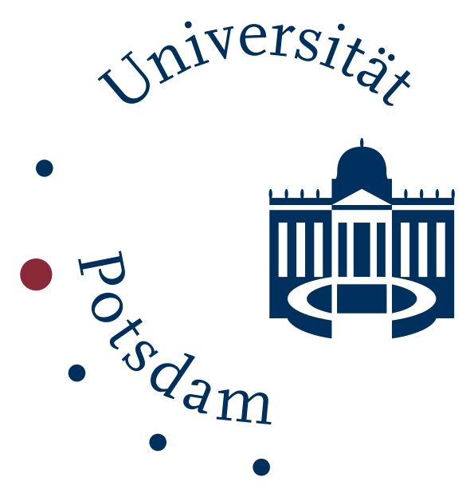

# What is DraCor?

*"DraCor = estrategia de guerrilla mediante estándares" ([José Calvo Tello](https://twitter.com/eumanismo/status/1218066125969412096))*

**DraCor is short for "drama corpora",** a growing collection of plays in (mostly) European languages, all encoded in [TEI](https://en.wikipedia.org/wiki/Text_Encoding_Initiative). We are maintaining some in-house corpora which we built from the ground up (GerDraCor and RusDraCor). In addition, we adapted (and enhanced) some corpora that were released under free licenses. We also host corpora maintained by others. Feel free to contact us if you are interested.

**DraCor is not primarily a website.** DraCor is a showcase for the concept of
[Programmable Corpora](https://doi.org/10.5281/zenodo.4284002). It revolves
around an API that provides data extracted from our TEI-encoded corpora.
This website – dracor.org – uses this API to showcase some of the extractable
information. Some data can be downloaded through the web interface. The more
powerful, direct access point is the [documented API](api).

**DraCor is an ecosystem.** You can connect to it on different levels. The corpora can be used freely, even independently of the platform itself. For ease of use, there is an interface providing access to specific slices of the corpora, i.e. research data that can be used directly in your own work, following the [FAIR principles](https://www.go-fair.org/fair-principles/). There are low-threshold apps that allow you to explore different aspects of the corpora (like our [DraCor Shiny app](https://shiny.dracor.org/) that lets you toy around with co-occurrence networks). We provide API wrappers for Python, R and Haskell (in development). But in general, you are free to connect to the API the way you prefer. You can be an active part of the DraCor ecosystem. (For inspiration, we still lack Twitter bots based on our API. 😊)

**DraCor sets out to be a living part of the Linked Open Data cloud.** We use Wikidata (and other) identifiers for authors and plays. We also expose a [SPARQL endpoint](https://dracor.org/sparql) so our own ontology can be queried, including many entities extracted from our corpora, like individual characters. (Have a look at the DraCor ontology [via WebVOWL](http://www.visualdataweb.de/webvowl/#iri=https://dracor.org/ontology).) Our LOD component will be further developed and we will look closely at how we can cooperate with neighbouring projects.

**DraCor aims to create an interface between traditional and digital literary studies.** The extent to which you can involve DraCor in your research on European drama (or literature in general), depends on your level of technical expertise (or support). We are part of the continuous learning process that accompanies the practice of Digital Humanities and actively support the creation of more teaching and training material around DraCor.

**DraCor's stability and sustainability** are key tasks for the near future. The project has come this far thanks to the enthusiasm of volunteers, without any direct third-party funding. While the platform will continue to evolve in parallel with new research questions, it should also become a stable infrastructure and reference point for (digital) literary studies and beyond. This will be a major focus of our ongoing work.

**Ways to interact.** To keep discussions about DraCor on the spot, we use the GitHub Discussions feature (which is still in beta!) for the repositories [dracor-frontend](https://github.com/dracor-org/dracor-frontend/discussions) (everything concerning the website) and [dracor-api](https://github.com/dracor-org/dracor-api/discussions) (everything concerning our API functionality). If you want, ask questions or make suggestions directly there.

Preferred hashtags: **#DraCor** **#dracor_org** **#ProgrammableCorpora** **#DigitalHumanities**

DraCor as a project and the platform dracor.org are run jointly by our team at Freie Universität Berlin and University of Potsdam. For a full list of credits, please see our [Credits page](credits).

